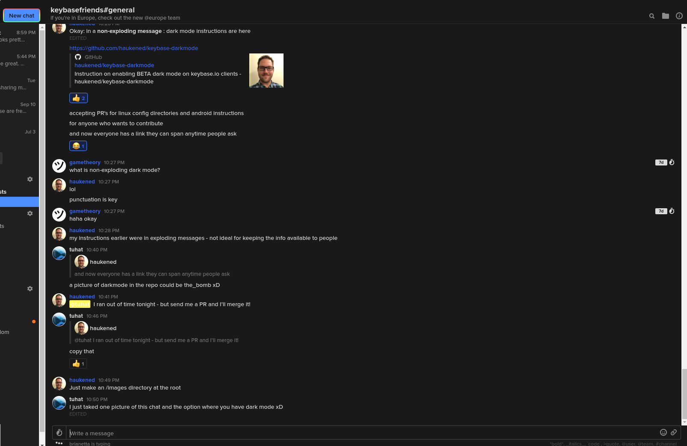
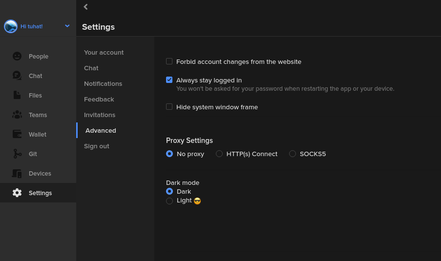

## this repo is now archived, as keybase released dark mode!

# So you want keybase dark mode...

I assume you're here because you just can't possibly wait for keybase dark mode.  If you're not, you're likely lost - head on over to [Google](https://google.com) to find what you're looking for there.

Below we'll detail how you can get dark mode (preview) enabled before the release in the official keybase app, but proceed with caution - ***the authors of this document are NOT responsible for nasty things that it or you might do to your computer/phone/tablet by following these instructions***

# Can I use this?
Currently, these platforms are able to:

| Windows | macOS | \*Nix | Android | iPhone |
|---------|-------|-------|---------|--------|
|   Yes   |  Yes  |  Yes  |   Maybe\*   |   No   |

\* Android May be possible by app side load, but is sufficiently difficult to be beyond the scope of this "beta" feature. 

# Getting up to date
First things first, you should be working with an up-to-date keybase client.

   - If you're on Linux, and brave, you can install a nightly build using the [officical documentation](https://keybase.io/docs/linux-user-guide#nightly-builds). This provides several darkmode bug fixes that aren't in the mainline branch.  If you do this, skip down to `Finding your configuration path`.

## Desktops:

1) Open a terminal

   Windows: `run cmd.exe`

   macOS: open `terminal`
   
   Linux with Gnome 3: open Activities and type `terminal`, click on the icon when it appears

2) Type `keybase update` and press enter.
3) You should see your current version as:

   `YYYY/MM/DD HH:MM:SS INFO Checking for update, current version is 4.5.0-*`

# Finding your configuration path

### Windows:
1) In that same terminal (you still have it open right?) type `keybase status` and press enter
2) look for the output in the `Service:` section that starts with `log:`

   (Mine says `C:\Users\haukened\AppData\Local\Keybase\keybase.kbfs.log` but your may vary depending on operating system and installation)
   
3) Remove the log filename from that to get the `PATH` to the directory

   (in my example that would be `C:\Users\haukened\AppData\Local\Keybase\`)
### Linux:
The path can usually be reached on any Linux system at `~/.cache/keybase/`. If that doesn't seem to exist, use the following steps to find it:
1) In that same terminal (you still have it open right?) type `keybase status` and press enter
2) look for the output in the `Service:` section that starts with `log:`

  (Mine says `/home/brian/.cache/keybase/keybase.service.log` but yours may vary depending on Linux distribution and installation)
  
3) Remove the log filename from that to get the `PATH` to the directory

  (in my example that would be `/home/brian/.cache/keybase/`)

# Creating the debug file
1) Go to that folder in your file explorer, terminal, or whatever you like to use

   Most Command Lines: `cd C:\Users\haukened\AppData\Local\Keybase\`
   
2) Create a new text file in that location called keybase.app.debug

   Windows: `haukened> notepad.exe c:\Users\haukened\AppData\Local\Keybase\keybase.app.debug`
   
   In a Linux terminal: `$ nano ~/.cache/keybase/keybase.app.debug`
   
   In a Linux desktop:
   
   - open any graphical text editor and save into `~/.cache/keybase/`
   - change the filename to `keybase.app.debug` and save again
   
3) In that file, place the following:

   `{ "featureFlagsOverride": "darkMode" }`

4) Save the file
5) Restart KeyBase (or you can just reboot, if you don't know how to exit keybase and restart the service)
6) In the KeyBase client, go to `Settings` -> `Advanced` -> `Dark Mode` and select the radio button for dark mode.
7) Enjoy your status as one of the cool kids.
8) (Optional) If you're 21+ and a consenting adult, have a beer.

# images

